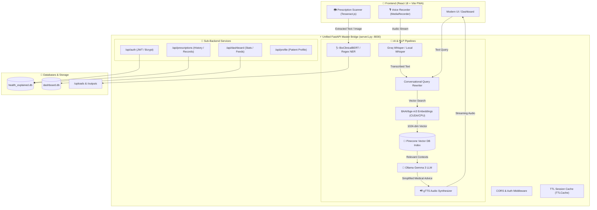

# 🏥 AI-Powered Healthcare Communication Assistant for Rural Communities

> **Bridging medical jargon, language barriers, and literacy gaps with Multilingual Voice AI, Vision-based Prescription Digitization, and Grounded RAG Intelligence.**

[](https://fastapi.tiangolo.com)
[](https://react.dev)
[](https://python.org)
[](https://ollama.com)
[](https://pinecone.io)
[](https://huggingface.co/BAAI/bge-m3)
[](https://groq.com)
[](https://tailwindcss.com)
[](LICENSE)

---

## 📖 Table of Contents

- [Overview & Problem Statement](#-overview--problem-statement)
- [Key Features](#-key-features)
- [System Architecture](#-system-architecture)
- [Project Directory Structure](#-project-directory-structure)
- [Technology Stack](#-technology-stack)
- [Prerequisites & System Requirements](#-prerequisites--system-requirements)
- [Installation & Quickstart](#-installation--quickstart)
- [Running the Services](#-running-the-services)
- [REST API Reference](#-rest-api-reference)
- [Voice & RAG Pipeline Deep Dive](#-voice--rag-pipeline-deep-dive)
- [Team Ownership & Modules](#-team-ownership--modules)
- [Roadmap & Future Scope](#-roadmap--future-scope)
- [Troubleshooting & FAQs](#-troubleshooting--faqs)
- [License](#-license)

---

## 🎯 Overview & Problem Statement

In rural and underserved communities worldwide, access to quality healthcare is severely hindered not only by doctor shortages, but by **critical communication gaps**:
1. **Medical Jargon & Illiteracy**: Prescriptions and lab reports are laden with complex Latin abbreviations, pharmacological names, and doctor handwriting that patients cannot comprehend.
2. **Language Barriers**: Healthcare literature and doctor instructions are predominantly in English, whereas rural patients speak regional native languages and vernacular dialects.
3. **Medication Non-Adherence**: Misunderstanding dosages, timings (e.g., before vs. after meals), and warnings leads to adverse drug reactions and untreated chronic conditions.

### ✨ The Solution
**AI-Powered Healthcare Communication Assistant** is an end-to-end, voice-first, multi-modal healthcare bridge that allows rural patients to:
- **Speak in their native tongue** or upload medical prescriptions/reports.
- Receive **instant clinical explanations simplified to a 5th-grade reading level**.
- Hear spoken responses in **10+ Indian languages** via voice synthesis.
- Track their active prescriptions, dosage alarms, and health history on an intuitive, accessible dashboard.

---

## 🚀 Key Features

### 🎙️ 1. Multilingual Voice-to-Voice AI Assistant
- **Speech-to-Text (STT)**: Ultra-fast transcription via Groq Cloud Whisper (`whisper-large-v3`) with seamless automatic fallback to local OpenAI Whisper (`base`).
- **Clinical Intelligence (LLM)**: Grounded medical reasoning powered by **Ollama Gemma 3** (`gemma3:1b` / `gemma3:4b` / `gemma3:latest`).
- **Text-to-Speech (TTS)**: Natural voice synthesis in regional languages powered by Google Text-to-Speech (`gTTS`).

### 🧠 2. Context-Aware Medical RAG Engine
- **Dense Vector Search**: Powered by **Pinecone Serverless Vector Index** (`infosys-healthcare-ai-assistant`).
- **SOTA Neural Embeddings**: **BAAI/bge-m3** multi-lingual multi-functional dense embedding model (running with full GPU VRAM CUDA acceleration).
- **Conversational Memory**: Session-based query rewriting resolves pronouns ("*What are its side effects?*") into fully grounded medical queries before vector matching.
- **Out-of-Domain Guardrails**: Automatic filtering blocks non-medical topics (e.g., politics, sports, coding) to maintain strict clinical safety.

### 📄 3. Prescription & Lab Report OCR Digitization
- **Dual-Layer OCR**: Client-side **Tesseract.js** for immediate browser previews + Backend **PyMuPDF / OpenCV / PaddleOCR** for high-fidelity multi-page PDF/image document parsing.
- **Clinical Named Entity Recognition (NER)**: Powered by **BioClinicalBERT** (`emilyalsentzer/Bio_ClinicalBERT`) paired with fallback regex tokenizers for extracting drug names, dosage intervals, frequency, and duration.

### 🌐 4. Vernacular Multilingual Support
- Real-time bi-directional translation across **10+ regional languages**:
  - **Hindi** (`hi`), **Tamil** (`ta`), **Telugu** (`te`), **Marathi** (`mr`), **Bengali** (`bn`)
  - **Gujarati** (`gu`), **Kannada** (`kn`), **Malayalam** (`ml`), **Punjabi** (`pa`), **English** (`en`)

### 📊 5. Patient Dashboard & Medication Management
- Real-time prescription history, status tracking (*Pending*, *Processing*, *Completed*).
- Medication reminder notifications and adherence logs.
- Patient health metrics and personalized profile management.

### 🔐 6. Enterprise-Grade Security & Authentication
- Secure JWT Bearer authentication (`access_token` and `refresh_token`).
- Bcrypt 72-byte password hashing (`passlib` + `bcrypt 4.0.1`).
- SQLite zero-configuration relational storage with ready PostgreSQL production migration paths.

---

## 🏗️ System Architecture



---

## 📂 Project Directory Structure

```text
infosys-chatbot/
├── .env                              # Active environment credentials (git-ignored)
├── .env.example                      # Complete environment configuration template
├── .gitignore                        # Git ignore rules for node_modules, .venv, etc.
├── ARCHITECTURE.md                   # Frontend & team architecture specifications
├── requirements.txt                  # Comprehensive Master Python dependencies
├── package.json                      # React & Node.js frontend dependencies
├── package-lock.json                 # Pinned Node package tree
├── server1.py                        # Unified FastAPI Master Server with Voice & RAG
├── query_rag.py                      # Standalone Pinecone + Ollama RAG CLI querying tool
├── voice_helpers.py                  # Groq/Local Whisper STT, gTTS TTS, & Translation utilities
├── test_bge.py                       # PDF Context Ingestion & BGE-M3 Pinecone indexing script
├── index.html                        # Vite HTML5 Entrypoint
├── vite.config.js                    # Vite bundler & PWA configuration
├── tailwind.config.js                # Tailwind CSS styling tokens & custom colors
├── postcss.config.js                 # PostCSS configuration
│
├── Dashboard_Backend_API/            # Dashboard Microservice
│   ├── main.py                       # Standalone Dashboard FastAPI entrypoint
│   ├── requirements.txt              # Sub-service dependencies
│   └── app/
│       ├── database/database.py      # SQLite / SQLAlchemy configuration
│       ├── models/                   # User, Prescription, Notification ORM models
│       └── routes/dashboard.py       # /api/dashboard router endpoints
│
├── healthcare-backend/               # Core Healthcare & Authentication Microservice
│   └── backend/
│       ├── app/
│       │   ├── api/v1/auth.py        # Authentication & JWT endpoints
│       │   ├── core/config.py        # Security & token settings
│       │   ├── database/session.py   # Database session factory
│       │   └── models/               # Patient & User database schemas
│       └── requirements.txt          # Backend sub-dependencies
│
├── medicalHistory_and_Profile_backend/ # Medical Records & OCR Processing Backend
│   └── medical_history_backend/
│       ├── app/
│       │   ├── config/settings.py    # OCR & BioClinicalBERT parameters
│       │   ├── routers/              # Prescriptions, profile, & history routers
│       │   └── services/             # OCR pipeline, NLP extractor, translation service
│       └── requirements.txt          # Medical backend sub-dependencies
│
└── src/                              # React 18 Frontend Source
    ├── App.jsx                       # Main Application Component & Router View
    ├── main.jsx                      # React DOM Entrypoint
    ├── index.css                     # Global styles & Tailwind utilities
    ├── assets/                       # Static branding images & icons
    ├── components/                   # Reusable UI component library
    │   ├── auth/                     # LoginForm, RegisterForm components
    │   ├── dashboard/                # DashboardHeader, RecentPrescriptionCard
    │   ├── healthcare/               # VoiceAssistant, MedicalSummary widgets
    │   ├── layout/                   # Navbar, BottomNav, Sidebar
    │   └── ui/                       # Radix UI / Shadcn primitives (Card, Button, Dialog)
    ├── pages/                        # Page-level route views
    │   ├── assistant/Assistant.jsx   # Interactive Voice & Chat AI Assistant page
    │   ├── dashboard/DashboardPage.jsx# Patient Overview Dashboard
    │   ├── history/                  # Prescription History & Detail inspection
    │   ├── profile/Profile.jsx       # User Health Profile & Settings
    │   └── upload/Upload.jsx         # Prescription OCR upload & scanner
    ├── services/                     # Axios API clients & endpoints integration
    └── utils/                        # Formatting, date, & text helpers
```

---

## 🛠️ Technology Stack

| Layer | Technologies | Purpose |
|---|---|---|
| **Frontend UI** | React 18, Vite 5, Tailwind CSS 3.4 | Mobile-first, responsive, ultra-fast web interface & PWA |
| **Component Library** | Radix UI, Shadcn UI, Lucide Icons | Accessible, high-contrast, tactile UI components |
| **Client-Side OCR** | Tesseract.js 7.0 | Instant on-device camera/image OCR preview |
| **Backend Gateway** | FastAPI, Uvicorn, Starlette | High-performance async REST API and streaming gateway |
| **Authentication** | Python-Jose, Passlib, Bcrypt | Secure JWT token handling and 72-byte password hashing |
| **Vector Database** | Pinecone Serverless Index | Scalable cloud vector search over clinical knowledge |
| **Embedding Model** | BAAI/bge-m3 (Sentence Transformers) | 1024-dimension multi-lingual dense vector representation |
| **LLM Inference** | Ollama (Gemma 3 1B/4B, LLaMA 3.2) | Local, private, zero-cloud-cost clinical reasoning |
| **Speech-to-Text** | Groq Cloud Whisper / OpenAI Whisper | Multi-lingual audio transcription from voice queries |
| **Text-to-Speech** | Google Text-to-Speech (gTTS) | Natural spoken audio in regional Indian languages |
| **Database & ORM** | SQLite 3, SQLAlchemy 2.0 | Lightweight, zero-config relational storage |
| **Document Parsing** | PyMuPDF, PyPDF, OpenCV | PDF vectorization, image rectification, document chunking |

---

## 💻 Prerequisites & System Requirements

### Software Prerequisites
- **Python**: `3.10` or `3.11` (Recommended)
- **Node.js**: `18.x` or `20.x` LTS
- **Ollama**: Installed from [ollama.com](https://ollama.com)
- **FFmpeg**: Required for audio processing (automatically configured via `imageio-ffmpeg` or system PATH).
- **Git**: Installed and configured.

### Hardware Recommendations
- **Minimum**:
  - CPU: 4 Cores
  - RAM: 8 GB
  - Storage: 10 GB free disk space
- **Recommended (For Local Real-Time Embeddings & LLM)**:
  - GPU: NVIDIA GeForce RTX (e.g., RTX 3060/4060 or higher) with CUDA 12+
  - RAM: 16 GB DDR4/DDR5
  - VRAM: 6 GB+

---

## ⚙️ Installation & Quickstart

### 1. Clone the Repository
```bash
git clone https://github.com/Springboard-Internship-2026/AI-Powered-Healthcare-Communication-Assistant-for-Rural-Communities_Jun_2026.git
cd AI-Powered-Healthcare-Communication-Assistant-for-Rural-Communities_Jun_2026
git checkout sayotrik
```

### 2. Configure Python Virtual Environment
```bash
# Create virtual environment
python -m venv .venv

# Activate virtual environment
# On Windows (PowerShell):
.venv\Scripts\Activate.ps1
# On Windows (Command Prompt):
.venv\Scripts\activate.bat
# On Linux / macOS:
source .venv/bin/activate

# Upgrade pip and install master dependencies
pip install --upgrade pip
pip install -r requirements.txt
```

### 3. Install Ollama & Pull the Medical Reasoning Model
Ensure [Ollama](https://ollama.com) is running on your machine:
```bash
# Pull the recommended Gemma 3 model
ollama pull gemma3:1b

# Optional: Pull larger models if you have dedicated GPU VRAM
ollama pull gemma3:4b
ollama pull llama3.2
```

### 4. Configure Environment Variables
Copy the `.env.example` template into `.env` and provide your credentials:
```bash
cp .env.example .env
```
Edit `.env` and fill in your keys:
```env
GROQ_API_KEY=your_groq_api_key_here
PINECONE_API_KEY=your_pinecone_api_key_here
GEMINI_API_KEY=your_gemini_api_key_here
OLLAMA_MODEL=gemma3:1b
```

### 5. Install Frontend Dependencies
```bash
npm install
```

---

## 🏃 Running the Services

### Option A: Start the Full-Stack Application (Recommended)

#### Step 1: Launch the Master FastAPI Backend
In your activated Python terminal:
```bash
python server1.py
```
> The Master API will start on **`http://localhost:8000`** and automatically mount the Dashboard, Medical History, Auth, Voice, and RAG routes.
> Interactive Swagger API docs are accessible at **`http://localhost:8000/docs`**.

#### Step 2: Launch the React Frontend
In a second terminal:
```bash
npm run dev
```
> The frontend will start at **`http://localhost:5173`**.

---

### Option B: Ingest Knowledge Base & Test RAG Pipeline

#### Ingest Clinical Guidelines into Pinecone
```bash
python test_bge.py
```
*Extracts clinical PDFs, generates contextual banners via Ollama, encodes embeddings via BGE-M3 (CUDA), and upserts vectors directly to Pinecone.*

#### Interactive CLI Medical Chat
```bash
python query_rag.py
```
*Run an interactive terminal session with conversation history, intent classification, and Pinecone vector retrieval.*

---

## 📡 REST API Reference

### 1. Voice, Assistant & RAG Routes

| Method | Endpoint | Description | Request Body / Params |
|---|---|---|---|
| `POST` | `/api/chat` | Send medical text query with chat history | `{ "query": str, "history": list, "language": str }` |
| `POST` | `/api/chat-stream` | Stream LLM token response with Pinecone RAG | `{ "query": str, "history": list, "language": str }` |
| `POST` | `/api/voice-chat` | Multi-modal Voice-to-Voice endpoint | Audio file (`multipart/form-data`) + Language |
| `POST` | `/api/stt` | Transcribe voice audio to text (Groq/Whisper) | Audio file (`multipart/form-data`) |
| `POST` | `/api/tts` | Convert text to speech audio stream (gTTS) | `{ "text": str, "language": str }` |

### 2. Authentication & User Routes

| Method | Endpoint | Description | Request Body / Params |
|---|---|---|---|
| `POST` | `/api/auth/register` | Register a new patient account | `{ "email": str, "password": str, "name": str }` |
| `POST` | `/api/auth/login` | Authenticate and obtain JWT tokens | Form data: `username`, `password` |
| `GET` | `/api/auth/me` | Retrieve currently logged-in user profile | Bearer Token in Header |
| `POST` | `/api/auth/refresh` | Refresh an expired access token | `{ "refresh_token": str }` |

### 3. Patient Dashboard & Notifications

| Method | Endpoint | Description | Request Body / Params |
|---|---|---|---|
| `GET` | `/api/dashboard/stats` | Retrieve overview statistics and counts | None |
| `GET` | `/api/dashboard/prescriptions` | Retrieve recent prescriptions feed | None |
| `GET` | `/api/dashboard/notifications` | Fetch medication & appointment alerts | None |

### 4. Prescriptions & OCR Pipeline

| Method | Endpoint | Description | Request Body / Params |
|---|---|---|---|
| `GET` | `/api/prescriptions` | List all historical patient prescriptions | Pagination params |
| `GET` | `/api/prescriptions/{id}` | Retrieve specific prescription details & analysis | `id: int` |
| `POST` | `/api/prescriptions/upload` | Upload new prescription image/PDF for processing | `file: UploadFile` |
| `DELETE`| `/api/prescriptions/{id}` | Delete a stored prescription record | `id: int` |

---

## 🔍 Voice & RAG Pipeline Deep Dive

```text
User Spoken Query (e.g., Tamil: "இந்த மாத்திரையை சாப்பாட்டுக்கு முன் சாப்பிட வேண்டுமா?")
  │
  ▼
[Groq Whisper STT / Local Whisper Fallback]
  │── Transcribes audio → "Should I take this medicine before food?"
  ▼
[Contextual Query Rewriter (Ollama Gemma 3)]
  │── Resolves past conversational turns ("it", "that medicine" → "Metformin 500mg")
  ▼
[BAAI/bge-m3 Embedding Function (GPU Accelerated)]
  │── Generates normalized 1024-dimensional dense vector
  ▼
[Pinecone Cloud Vector Search]
  │── Fetches top-5 highest similarity medical chunks (Cosine score > 0.55)
  ▼
[Medical Safety & Guardrail Filter]
  │── Rejects non-clinical queries & checks score threshold
  ▼
[Ollama Gemma 3 Prompt Synthesis]
  │── Generates structured, empathetic, 5th-grade reading level advice
  ▼
[Multilingual Translation & gTTS Audio Generation]
  │── Translates to user's native language & streams MP3 voice audio back to device
```

---

## 👥 Team Ownership & Modules

| Contributor | Focus Area | Key Deliverables |
|---|---|---|
| **Sayotrik** | **Voice Assistant, RAG & Backend Architecture** | Master API (`server1.py`), Pinecone & BGE-M3 Pipeline (`test_bge.py`, `query_rag.py`), Voice Helpers (`voice_helpers.py`), System Integration |
| **Amrutha** | **Authentication & Security** | JWT token lifecycle, Password hashing, User registration & login flows |
| **Hyndavi** | **Home, Dashboard & Upload** | Dashboard overview, File upload UI, Camera capture & OCR preview |
| **Santosh** | **Results & Simplification** | Medical jargon simplification, Multilingual translation tabs, Readability scores |
| **Yasaswini** | **History & Prescription Details** | Medical history view, Prescription inspection, Dosage schedule & timeline |

---

## 🔮 Roadmap & Future Scope

- [ ] **WhatsApp & Telegram Bot Integration**: Enable rural users to send voice notes and prescription photos directly through WhatsApp without needing to install an app.
- [ ] **Offline Edge AI Deployment**: Optimize Gemma 3 with 4-bit quantization (GGUF) to run completely offline on low-cost devices like Raspberry Pi 5 or NVIDIA Jetson for clinics without internet connectivity.
- [ ] **Vernacular Dialect Acoustic Adaptation**: Fine-tune Whisper STT on rural colloquial audio datasets to better handle non-standard regional dialects and background noise.
- [ ] **Automated Medication SMS Alarms**: Integration with Twilio / SMS gateways to send local-language dosage reminders to basic feature phones.

---

## ❓ Troubleshooting & FAQs

<details>
<summary><b>1. Ollama connection fails or model not found</b></summary>

- Make sure the Ollama application is running in the background (`ollama serve`).
- Verify the model is downloaded by running:
  ```bash
  ollama list
  ollama pull gemma3:1b
  ```
</details>

<details>
<summary><b>2. CUDA out of memory error when running BGE-M3</b></summary>

- In `server1.py` and `test_bge.py`, the system automatically detects CUDA. If your GPU has limited VRAM (< 4 GB), set `device="cpu"` when loading `SentenceTransformer("BAAI/bge-m3")`.
</details>

<details>
<summary><b>3. PyMuPDF or OpenCV build issues on Windows</b></summary>

- Install pre-built wheels using:
  ```bash
  pip install --only-binary :all: pymupdf opencv-python-headless
  ```
</details>

<details>
<summary><b>4. Missing FFmpeg on Windows</b></summary>

- `voice_helpers.py` automatically bundles and configures static FFmpeg via `imageio-ffmpeg`. If you encounter path issues, ensure `imageio-ffmpeg` is installed:
  ```bash
  pip install imageio-ffmpeg
  ```
</details>

---

## 📜 License

This project is licensed under the **MIT License** — feel free to use, modify, and distribute for educational and healthcare accessibility purposes.

---

<p align="center">
  <b>Built with ❤️ for Rural Healthcare Accessibility • Shreenidhi</b>
</p>
